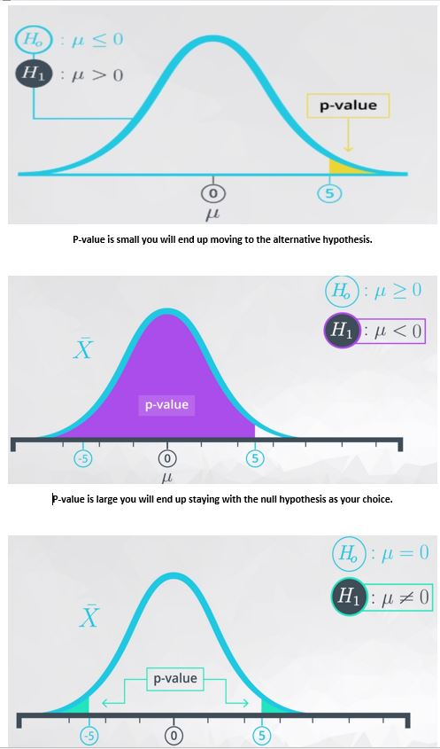
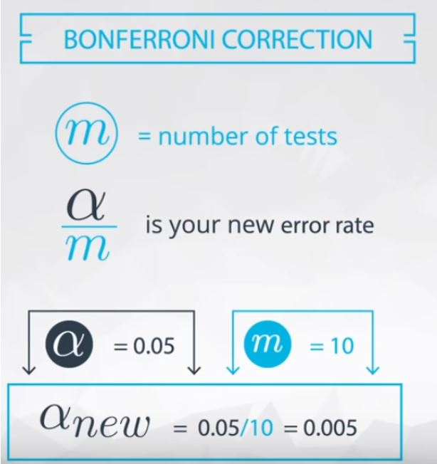

# Hypothesis testing
 In these notebooks ([1](https://github.com/A2Amir/Hypothesis-testing/blob/master/What%20is%20the%20impact%20of%20sample%20size.ipynb),[2](https://github.com/A2Amir/Hypothesis-testing/blob/master/Multiple%20Testing.ipynb)) we will be learning:
 
 * The null hypothesis is what we assume to be true before we collect any data, and the alternative is usually what we want to try and prove to be true.

* Type I errors are the worst type of errors, and these are associated with choosing the alternative when the null hypothesis is actually true.

* p-values are the probability of observing your data or something more extreme in favor of the alternative given the null hypothesis is true. You learned that using a confidence interval from the bootstrapping samples, you can essentially make the same decisions as in hypothesis testing (without all of the confusion of p-values).

* How to make decisions based on p-values. That is, if the p-value is less than your Type I error threshold, then you have evidence to reject the null and choose the alternative. Otherwise, you fail to reject the null hypothesis.

* When sample sizes are really large, everything appears statistically significant (that is you end up rejecting essentially every null), but these results may not be practically significant. 

* When performing multiple hypothesis tests, your errors will compound. Therefore, using some sort of correction to maintain your true Type I error rate is important. A simple, but very conservative approach is to use what is known as a Bonferroni correction, which says you should just divide your α\alphaα level (or Type I error threshold) by the number of tests performed.

* The Law of Large Numbers says that as our sample size increases, the sample mean gets closer to the population mean.

* The Central Limit Theorem states that with a large enough sample size the sampling distribution of the mean will be normally distributed. The Central Limit Theorem actually applies for these well known statistics:

   * Sample means (x¯)
   * Sample proportions (p)
   * Difference in sample means (x¯1−x¯2)
   * Difference in sample proportions (p1−p2)
